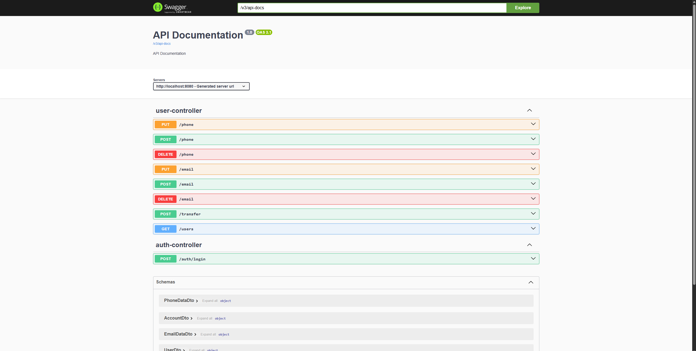
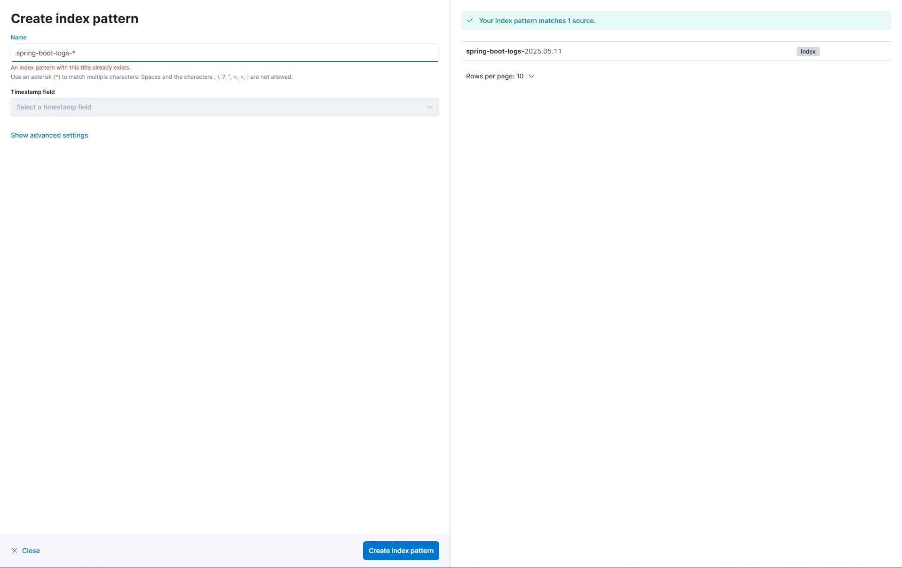
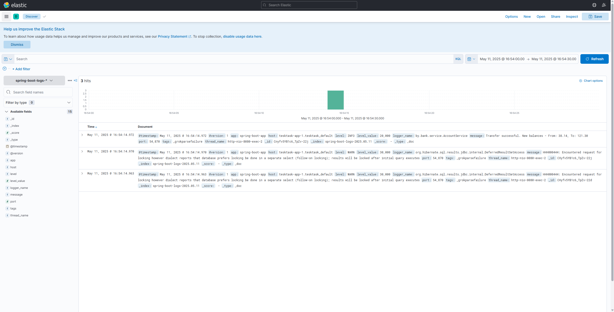
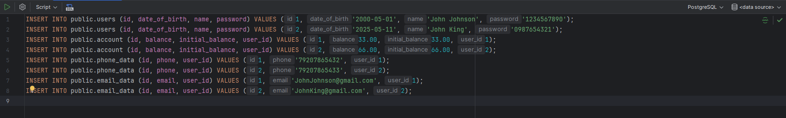

## Run Locally

Clone the project

```bash
  clone https://github.com/Arthurchkeee/TestTask
```

Run docker container

```bash
  docker-compose up -d
```

## Services and Ports

Service 	Port(s)	Access URL
Elasticsearch	9200, 9300	http://localhost:9200
Logstash	5000	TCP input on port 5000
Kibana	5601	http://localhost:5601
PostgreSQL	5435	jdbc:postgresql://localhost:5435/your_database
Redis	6379	redis://localhost:6379
Application	8080	http://localhost:8080

|  Service |  Port(s) | Access URL                            |
|---|---|---------------------------------------|
| Elasticsearch  | 9200, 9300  | http://localhost:9200                 |
| Logstash  | 5000  | TCP input on port 5000                |
| Kibana  |5601| http://localhost:5601                 |
|    PostgreSQL     |  5435  | jdbc:postgresql://localhost:5435/task |
|        Redis           |    6379    |               redis://localhost:6379                        |
|          Application              |      8080      |     http://localhost:8080       |

## Swagger
You can watch api information on http://localhost:8080/swagger-ui/index.html

## Kibana
I use kibana for logs monitoring 
Kibana awailable on http://localhost:5601/ and You can watch it after adding this index


## DB
DB running with this data for auth
 
